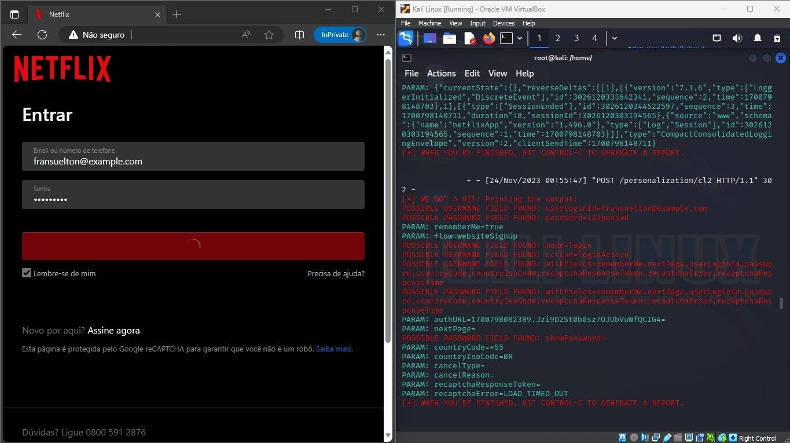
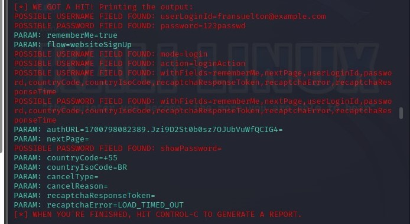

# Phishing para captura de senhas da Netflix 🎣

### 🛠️ Ferramentas Utilizadas

- Kali Linux
- setoolkit

### ⚙️ Configurando o Phishing no Kali Linux

- Acesso root ao terminal: ``` sudo su ```
- Iniciando o setoolkit: ``` setoolkit ```
- Tipo de ataque: ``` Social-Engineering Attacks ```
- Vetor de ataque: ``` Web Site Attack Vectors ```
- Método de ataque: ```Credential Harvester Attack Method ```
  - O método Credential Harvester Attack utilizará a clonagem de um site que possui um campo de nome de usuário e senha e coletará todas as informações postadas no site.
- Método de ataque: ``` Site Cloner ```
- Obtendo o endereço da máquina: ``` ifconfig ```
  - O IP da máquina vem por padrão, basta apertar Enter
- URL para clone: http://www.netflix.com/br/login

## ✅ Resutados

### Página Web com o Terminal:

### Credenciais capturadas:


## 📝 Observações

- No Desafio original onde o site clonado era o facebook, quando fui pegar as credencias não funcionou. Provavelmente o Facebook adicionou alguma tecnologia para bloquear esse tipo de ação da ferraamenta, assim como o LinkedIn.

- Decidi usar a página de login da Netflix para resolução do Desafio de projeto.